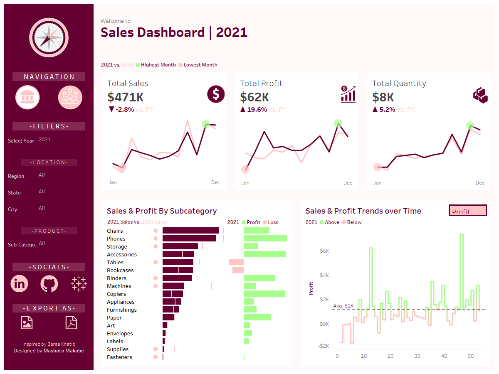
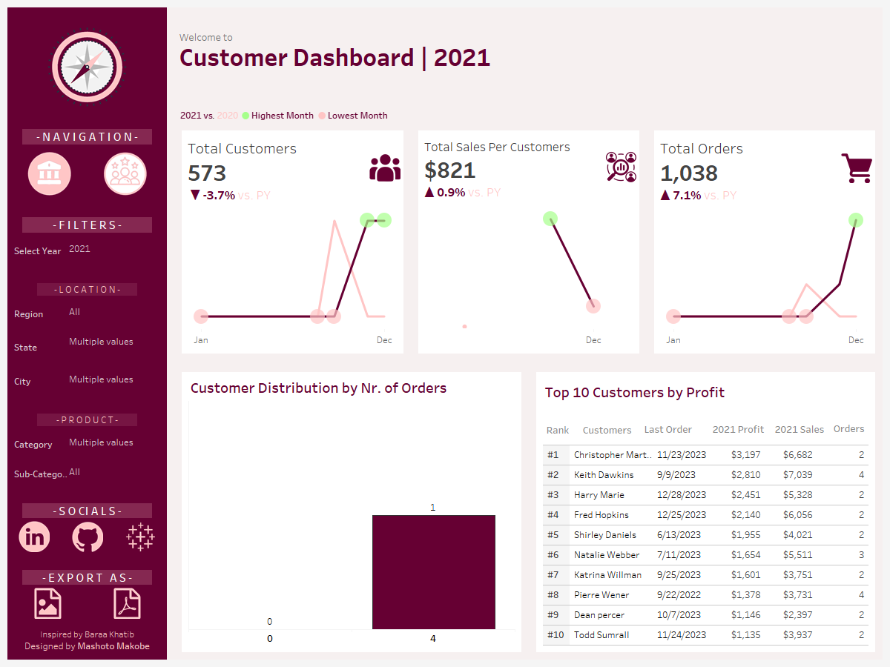

            

  

<h1 align="center"><strong>Dashboard Design Process</strong></h1>

  A structured, end-to-end walkthrough of designing intuitive, insight-driven dashboards, from requirement gathering to final delivery.

---

<h2 id="top">Table of Contents</h2>

- [Project Phases](#project-phases)
  - [1. Analyse Requirements](#1-analyse-requirements)
  - [2. Build Data Source](#2-build-data-source)
  - [3. Build Charts](#3-build-charts)
  - [4. Build Dashboard](#4-build-dashboards)
- [Dashboard Color Scheme](#dashboard-color-scheme)
- [Container Mockup](#container-mockup)
- [Dashboard Mockup](#dashboard-mockup)
- [Sales and Customer Dashboards](#sales-and-customer-dashboards)
- [Author](#author)

---

## Project Phases

The dashboard was built following a deliberate, user-centric design process, one that prioritizes clarity, usability, and actionable insight at every stage. Rather than jumping straight into building, the process begins with understanding: who the end user is, what decisions they need to make, and what data will best support those decisions. The four phases below capture that journey from concept to completion.

---

### 1. Analyse Requirements

Every well-designed dashboard starts with the right questions. This phase focuses on aligning the design with user needs before a single chart is built.

- Gather and document user requirements
- Identify the most appropriate chart types for each data story
- Sketch initial mockups to visualize layout and flow
- Define a color palette that supports readability and brand consistency

---

### 2. Build Data Source

With requirements clearly defined, the next step is establishing a clean, reliable data foundation. This ensures that every metric displayed is accurate and trustworthy.

- Connect to the relevant data sources
- Design and configure the data model
- Rename fields and tables for clarity and consistency
- Validate data types to prevent errors downstream

---

### 3. Build Charts

With the data model in place, individual visualisations are created and carefully formatted to communicate their insights without visual noise.

- Develop and test calculated fields to ensure accuracy
- Build each chart to match the planned design
- Format for polish and precision:
  - Remove unnecessary gridlines and borders
  - Clean up and simplify axis labels
  - Apply the defined color scheme consistently
  - Configure informative, context-aware tooltips

---

### 4. Build Dashboards

The final phase brings all components together into a cohesive, interactive dashboard experience. Attention to layout, spacing, and interactivity elevates the product from functional to exceptional.

- Sketch container-level mockups to plan structural layout
- Build the container hierarchy and nested structure
- Assemble all charts into their designated positions
- Format the overall layout:
  - Distribute objects evenly for visual balance
  - Apply consistent colors, sizes, and typography
  - Set the view to "Entire View" for a clean fit
  - Add legends where necessary for interpretability
  - Fine-tune inner and outer padding for breathing room
- Integrate filters to enable interactive data exploration
- Add branding elements including the logo, and navigation controls for moving between dashboards

---

## Dashboard Color Scheme

The color scheme was designed to feel modern, professional, and visually coherent. It draws directly from the brand's logo colors, creating a sense of visual continuity between the product and its identity. The palette is divided into two categories: base colors used for text and structural typography, and custom accent colors, derived from the logo, applied to charts, highlights, and key UI elements. Together, they strike a balance between clarity and character.

---

## Container Mockup

Before any live dashboard was assembled, a high-fidelity container mockup was created to map out the structural framework of the interface. This blueprint establishes the spatial logic of the layout and ensures that data, controls, and branding all have a clear and intentional home.

The mockup defines the following core regions:

- **Header** - branding and top-level navigation
- **Main Dashboard Area** - the primary canvas, housing:
  - Key Performance Indicators (KPIs) for at-a-glance metrics
  - Data visualisations and charts for deeper exploration
  - Interactive filters and controls for user-driven analysis
- **Supplementary Sidebar** - menu options and secondary navigation

This wireframe serves as both a design reference and a communication tool, making it easy to align on structure, hierarchy, and user flow before committing to the build.

---

## Dashboard Mockup

> **Coming soon** - a full dashboard mockup is currently in progress and will be added here upon completion.

---

## Sales and Customer Dashboards

The project delivers two purpose-built dashboards, each focused on a distinct analytical perspective:

- **Sales Dashboard** - tracks revenue performance, trends, and key sales metrics

- **Customer Dashboard** - surfaces customer behaviour, segmentation, and engagement insights

Click **[]**  to view the interactive dashboard on Tableau Public
---

## Author

