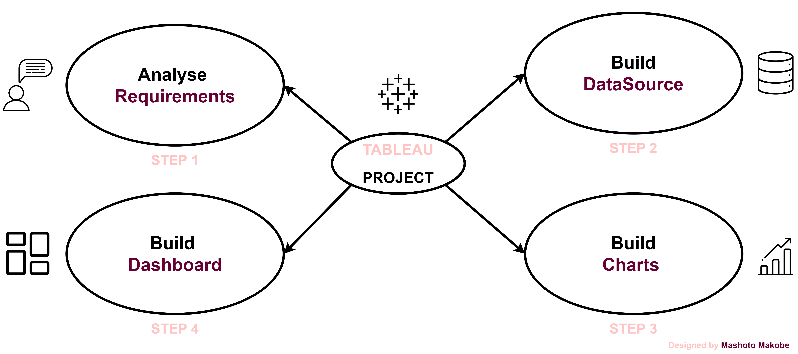
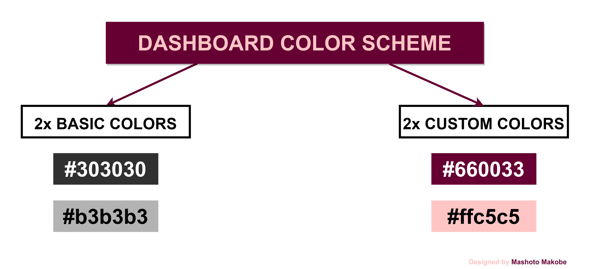

<h1> Dashboard Design Process</h1>

<h2> 1 Analyze Requirements</h2>

* Collect requirements
* Choose right charts
* Draw mockup
* Choose colors

<h2> 2 Build Data Source </h2>

* Connect data
* Create  data model
* Rename fields of tables
* Check data type

<h2> 3 Build Charts </h2>

* Create calculated fields and test them
* Build charts
* Format

  * Remove lines & grids
  * Clean up axis
  * coloring
  * tooltips

<h2> 4 Build Dashboard </h2>

* Draw mockup for containers
* Create container structure
* Put all the charts together
* Format

  * Distribute object evenly
  * Format colors, sizes, ect.
  * Fit "Entire View"
  * Add legends
  * Add spaces (inner and outer padding)
* Add filters for interactivity
* Add icons (logo and navigation between dashboards)

<h1> Dashboard Mockup</h1>
[coming soon :)]
<h1>Container Mockup</h1>

The dashboard container mockup showcases the layout and design of key components, including:

* Title
* Main dashboard area with strategic placements of :

  * Charts and visualizations
  * KPI indicators
  * Filters and controls
* Side bar with navigation, branding, amd menu options

This mockup provides a visual representation of the dashboard's structure, user interface, and key element placements, demonstrating the flow and organization of data insights

<h1> Dashboard Color Scheme</h1>

The dashboard features a modern and intuitive color scheme that leverages the brand's logo colors to create a cohesive visual experience.The palette consists of basic and custom colors.

This color scheme enhances user experience, provide visual clarity and maintain brand consistency.